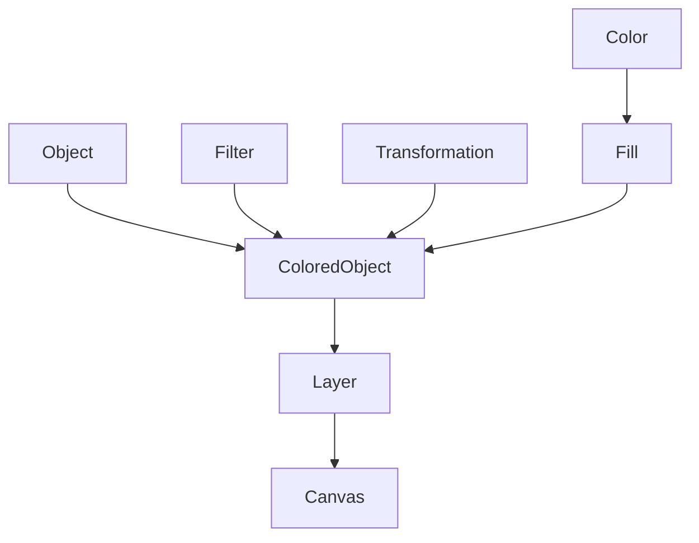

# Shapemaker Graphics module

Handles objects that can be rendered to SVG

Actual implementation of the SVG rendering logic is in `../rendering`, not here.

A Shapemaker image is represented by a Canvas, which is comprised of multiple Layers. Those Layers contain multiple Colored Objects.

Those Colored Objects are a combination of a Fill, possibly Filters and Transformations, as well as a "plain" Object (which can be a Line, a Polygon, a Point, a BigCircle, etc. (check the enum's different variants))

A Fill is made up of a Color alongside the Fill variant: Solid, Hatched, Dotted, Translucent etc.

A color is "abstract", meaning its just a named color (red, green, etc). Actual hex values are given when rendering, through a ColorMapping.

  
